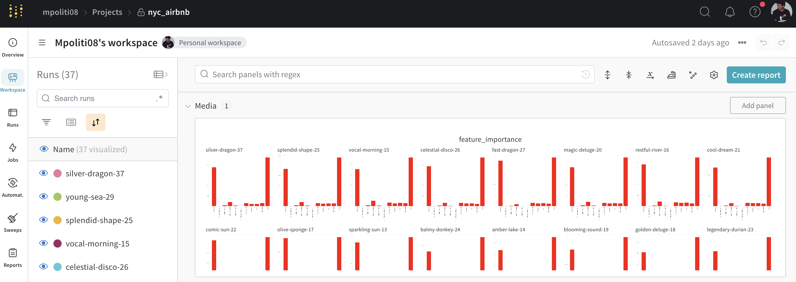

# Final Project: ML Pipeline for Short term Rental Prices in NYC

This GitHub is my solution to a project of one the Machine Learning Devops Nanodegree.

<p align="center">
  
</p>

### For Reviewers

You can fing my results and code at the following links

- wandb url: https://wandb.ai/mpoliti08/nyc_airbnb/overview?nw=nwusermpoliti08
- github url: https://github.com/March-08/build-ml-pipeline-for-short-term-rental-prices

## Description

The focus of this project is to build and end to end machine learning learnrning pipeline for short term rental prices in NYC. In this project we investigate the integration of several tools that enanble us to perform experimentations in a clear and structure way. The tools on which we focused are:

- Hydra: for configurations and hyperparameter tuning
- W&B: used as artifact store, data versioning, and monitoring the training
- MLflow: to orchestrate the whol ML lifecycle.

## Dataset

The open source dataset is about rental prices in New York City, provided by Airbnb.

## Install Dependecies

All the steps of the pipeline can be run levareging MLflow. So this is the onlu thing you need to install.
Then MLflow will take care of installing averyting else is needed for each component of the pipeline, creating isolated virtual environments for each component. In order to install MLflow:

```bash
> pip install mlflow
```

To make sure your installed mlflow succesfully run the following command.

```bash
> pip show mlflow
```

### Running the entire pipeline or just a selection of steps

Now you should be able to run the entire pipeline from the root directory using mlflow.

```bash
> mlflow run .
```

If you want to run the `download` and the `basic_cleaning` steps, you can similarly do:

```bash
> mlflow run . -P steps=download,basic_cleaning
```

You can override any other parameter in the configuration file using the Hydra syntax, by
providing it as a `hydra_options` parameter. For example, say that we want to set the parameter
modeling -> random_forest -> n_estimators to 10 and etl->min_price to 50:

```bash
> mlflow run . \
  -P steps=download,basic_cleaning \
  -P hydra_options="modeling.random_forest.n_estimators=10 etl.min_price=50"
```

### Monitor training and artifact

All the steps in the pipeline will produce results (in term of performance and artifacts) that will be saved into [wandb](https://wandb.ai/mpoliti08/nyc_airbnb/overview?nw=nwusermpoliti08).


Make sure you have a wandb account, and you are logged in:

```bash
> wandb login
```

## License

[License](LICENSE.txt)
